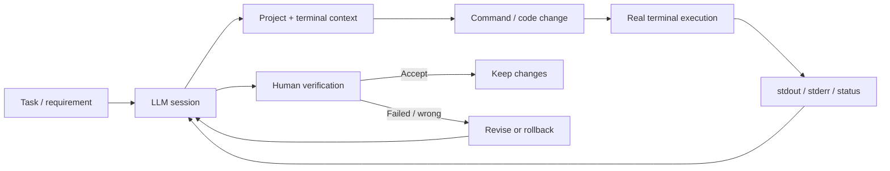

  <a href="README.md">Українська</a> · <a href="README.ru.md">Русский</a> · <a href="README.en.md">English</a>

  

# AI Development Workbench

**Portfolio case study of a customized Wove-based AI-assisted development environment.**  
A local human-in-the-loop workflow that connects an LLM session with real project context, an interactive terminal, command execution, runtime output, and explicit human validation.

  
  
  
  
  
  

> [!IMPORTANT]
> This is a **public portfolio case study**, not a source repository. The working implementation is private. The current application is a **custom modification of Wove**; third-party/open-source components remain subject to their original licenses.

| | |
|---|---|
| **Solution type** | Desktop developer tool / AI-assisted workflow |
| **Base** | Wove, customized for my development workflow |
| **My role** | Problem definition, workflow design, architecture decisions, AI-assisted implementation, runtime validation |
| **Core integration** | Browser/LLM ↔ project context ↔ interactive terminal |
| **Status** | Actively used in day-to-day development |
| **Source code** | Private |

---

## 🖥️ Product in Action

The image below is a **real working screenshot**, not a concept mockup. On the left is an LLM session with task context and commands; on the right is the customized Wove environment with an interactive terminal and the real project state.

  

LLM plans a change → command executes in the real terminal → stdout/stderr return to the workflow → the result is validated by a human.

---

## 🎯 Engineering Problem

Chat-based AI can generate code, but it usually lacks access to the **actual state of the development environment**. During longer development sessions, terminal output, errors, repository state, build/runtime results, and follow-up instructions have to be moved between tools manually.

That creates unnecessary friction and introduces a real risk of using **stale output or output from the wrong session**.

## 💡 Solution

I customized Wove around a workflow where a browser-based LLM session is connected to a specific working terminal, and execution results are fed back into the same development loop.

The system is intentionally **human-in-the-loop**: AI accelerates implementation and analysis, but the output is not trusted until it has been validated in the real environment.

---

## ✅ Implemented

| Area | What the system does |
|---|---|
| **Terminal context bridge** | Makes relevant real terminal context available without repeated manual copy/paste |
| **Browser ↔ terminal binding** | Connects a specific LLM session to a specific working terminal |
| **Multi-session isolation** | Prevents state from parallel tabs/tasks from being mixed |
| **Request correlation** | Uses request IDs to associate requests with the correct results |
| **Stale-result protection** | Prevents delayed output from being treated as the result of a newer operation |
| **Execution-state tracking** | Distinguishes sent / running / intermediate output / completed states |
| **Validation workflow** | Supports change → build/runtime check → inspect → accept/revise |
| **Rollback-oriented process** | Uses checkpoints/backups and safe rollback as part of the normal workflow |

---

## 👤 My Role

My workflow is:

> **define the problem → specify requirements → choose the architecture → adapt an existing component → implement changes with AI-assisted development → run them in the real environment → inspect actual behavior → accept / revise / rollback**

I own the problem definition, workflow and architecture decisions, integration strategy, work with the existing codebase, runtime testing, investigation of race/stale-state issues, and the final decision to accept or revert a change.

---

## 🧰 Technology Stack

`TypeScript` · `JavaScript` · `Electron` · `React` · `Node.js` · `Wove` · `xterm` · `PowerShell / terminal integration` · `Git / GitHub` · `runtime logging` · `targeted tests`

The implementation is based on a customized Wove codebase. Its package metadata uses Apache-2.0; relevant third-party components are not relicensed by this portfolio repository.

---

## 📈 Result

The workbench shortens the feedback loop between:

**task → analysis → change → execution → real output → correction → validation**

Its main value is not simply “generate more code”, but to **reduce context loss and repetitive manual switching between AI, project state, and the runtime environment**.

## 🔎 Why This Case Matters

This project demonstrates my ability to understand and adapt an existing complex product, design integrations between browser UI and runtime components, reason about state/concurrency/stale results, and use AI as an engineering multiplier while preserving explicit human control.

---

## 🎥 Demo / Technical Discussion

The working source code is private, but during a technical interview I can demonstrate the live workflow and discuss request correlation, stale-result guards, session isolation, terminal integration, and the validation/rollback process.

> See [NOTICE.md](NOTICE.md) for source-code and third-party licensing notes.
