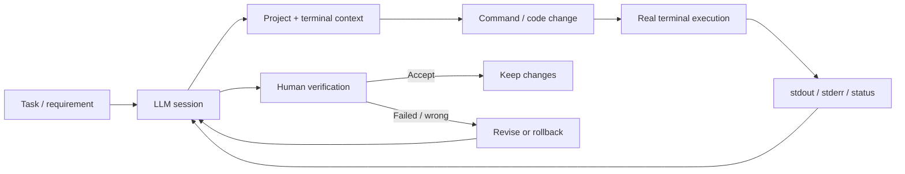

  <a href="README.md">Українська</a> · <a href="README.ru.md">Русский</a> · <a href="README.en.md">English</a>

  

# AI Development Workbench

**Портфоліо-кейс модифікації Wove для AI-assisted development.**  
Локальне human-in-the-loop середовище, яке поєднує LLM-сесію, реальний контекст проєкту, інтерактивний термінал, виконання команд і перевірку фактичного результату.

  
  
  
  
  
  

> [!IMPORTANT]
> Це **публічний portfolio case study**, а не репозиторій з вихідним кодом. Робоча реалізація приватна. Поточний застосунок є **кастомною модифікацією Wove**, а сторонні/open-source компоненти залишаються під умовами своїх оригінальних ліцензій.

| | |
|---|---|
| **Тип рішення** | Desktop developer tool / AI-assisted workflow |
| **Основа** | Wove, модифікований під власний workflow |
| **Моя роль** | Постановка задачі, workflow design, архітектурні рішення, AI-assisted implementation, runtime validation |
| **Ключова інтеграція** | Browser/LLM ↔ project context ↔ interactive terminal |
| **Статус** | Активно використовується у щоденній розробці |
| **Вихідний код** | Private |

---

## 🖥️ Product in Action

Нижче — **реальний скріншот робочого середовища**, а не макет. Зліва працює LLM-сесія з контекстом задачі та командами, справа — модифікований Wove з інтерактивним терміналом і фактичним станом проєкту.

  

LLM планує зміни → команда виконується у реальному терміналі → stdout/stderr повертаються у workflow → результат перевіряється людиною.

---

## 🎯 Бізнес / engineering проблема

Звичайний chat-based AI добре генерує код, але погано бачить **фактичний стан робочого середовища**. Під час довгої розробки доводиться вручну переносити між чатами та інструментами:

- поточну задачу і контекст проєкту;
- команди для виконання;
- stdout / stderr;
- результати build/runtime перевірок;
- стан репозиторію;
- наступні інструкції після помилки;
- інформацію про те, яка вкладка або термінал належать конкретній задачі.

Це збільшує кількість ручних дій і створює ризик використати **застарілий або чужий результат**.

## 💡 Рішення

Я перебудувала Wove під workflow, у якому браузерна LLM-сесія та конкретний робочий термінал пов'язані між собою, а результат виконання повертається у той самий цикл розробки.

Система навмисно залишається **human-in-the-loop**: AI прискорює аналіз і реалізацію, але не отримує права вважати власний результат правильним без runtime-перевірки.

---

## ✅ Реалізовано

| Напрям | Що робить система |
|---|---|
| **Terminal context bridge** | Передає релевантний фактичний terminal context без постійного ручного copy/paste |
| **Browser ↔ terminal binding** | Прив'язує конкретну LLM-сесію до конкретного робочого термінала |
| **Multi-session isolation** | Не дозволяє контексту паралельних вкладок/задач змішуватися |
| **Request correlation** | Використовує request-id для зіставлення запиту і результату |
| **Stale-result protection** | Захищає від використання запізнілого результату як відповіді на новішу операцію |
| **Execution-state tracking** | Розрізняє sent / running / intermediate output / completed |
| **Validation workflow** | Підтримує цикл change → build/runtime check → inspect → accept/revise |
| **Rollback-oriented process** | Робота будується навколо checkpoint / backup і безпечного відкату |

---

## 👤 Моя роль

Це не проєкт «AI сам написав програму». Мій робочий цикл виглядає так:

> **визначити проблему → сформувати вимоги → вибрати архітектуру → адаптувати існуючий компонент → реалізувати зміни з AI-assisted development → запустити в реальному середовищі → перевірити фактичну поведінку → прийняти / змінити / відкотити**

Я відповідаю за:

- постановку задачі та критерії готовності;
- дизайн workflow і взаємодію компонентів;
- рішення про те, що адаптувати, а що реалізувати окремо;
- роботу з існуючою кодовою базою;
- тестування та аналіз runtime output;
- виявлення race/stale-state проблем;
- прийняття або rollback змін.

---

## 🧰 Technology Stack

`TypeScript` · `JavaScript` · `Electron` · `React` · `Node.js` · `Wove` · `xterm` · `PowerShell / terminal integration` · `Git / GitHub` · `runtime logging` · `targeted tests`

Реалізація побудована на модифікованому Wove. У його package metadata використовується Apache-2.0; відповідні сторонні компоненти не перелицензовуються цим portfolio repository.

---

## 📈 Результат

Workbench скорочує feedback loop між:

**задача → аналіз → зміна → виконання → реальний output → виправлення → перевірка**

Головна цінність інструмента для мене — не «генерувати більше коду», а **зменшити втрату контексту і кількість ручних переходів між AI, проєктом та runtime-середовищем**.

## 🔎 Чому цей кейс важливий

Проєкт показує мою здатність:

- розібрати існуючий складний продукт і адаптувати його замість переписування з нуля;
- проєктувати інтеграції між browser UI, runtime і локальним середовищем;
- працювати зі станом, конкурентністю та застарілими результатами;
- будувати інструмент навколо реального робочого процесу;
- використовувати AI як engineering multiplier, зберігаючи людський контроль над рішеннями.

---

## 🎥 Demo / technical discussion

Вихідний код робочої реалізації не публікується, але під час технічної співбесіди я можу:

- показати live workflow;
- продемонструвати взаємодію LLM і термінала;
- пояснити архітектурні рішення;
- обговорити request correlation, stale guards, session isolation і validation/rollback flow.

> Детальні умови щодо приватного коду та сторонніх компонентів: [NOTICE.md](NOTICE.md)
