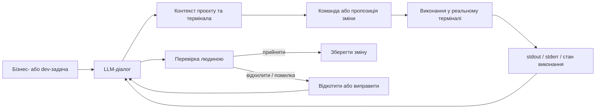

# AI Development Workbench

[Українська](README.md) · [Русский](README.ru.md) · [English](README.en.md)

> **Кодова назва проєкту:** GPTLover  
> **Статус:** активно використовується у моєму щоденному процесі розробки  
> **Вихідний код:** приватний

Human-in-the-loop середовище для AI-assisted development, створене для того, щоб зменшити розрив між розмовою з LLM, реальним станом проєкту та інтерактивним терміналом.

Проєкт з’явився через практичну проблему: під час розробки через звичайний чат доводилося вручну переносити між інструментами контекст термінала, помилки, стан репозиторію, результати команд і наступні інструкції.

AI Development Workbench об’єднує цей фрагментований процес у керований workflow, у якому людина залишається тим, хто приймає рішення.

---

## Проблема

Коли LLM використовується для реальної розробки, складність часто полягає не у генерації коду, а в тому, щоб модель працювала з **фактичним станом проєкту**:

- яка команда була виконана;
- що реально повернули stdout/stderr;
- до якого термінала або сесії належить результат;
- чи залишається результат актуальним;
- чи пройшла зміна build/runtime перевірки;
- чи була зміна прийнята людиною або відкотилася.

Ручний copy/paste працює для невеликих задач, але стає повільним і ненадійним під час довгих сесій налагодження та розробки.

---

## Рішення

Я спроєктувала AI-assisted workflow, який зв’язує браузерну LLM-сесію з реальним інтерактивним терміналом і контекстом проєкту.

Система навмисно побудована як **human-in-the-loop**. Згенерований код або результат команди не вважається автоматично правильним: зміни перевіряються у реальному середовищі перед прийняттям.

---

## Що я спроєктувала та реалізувала

### Міст контексту термінала

Система збирає релевантний контекст термінала та передає його в AI-workflow без постійного ручного copy/paste.

### Інтеграція браузера і термінала

Конкретна браузерна LLM-сесія пов’язується з конкретним робочим терміналом/сесією, щоб контекст різних задач не змішувався.

### Ізоляція кількох сесій

Workflow враховує паралельну роботу з кількома вкладками, терміналами та задачами і не повинен змішувати їхній стан.

### Request correlation і захист від застарілих результатів

Використовуються request-id та stale-response guards, щоб затриманий або застарілий результат не був помилково прив’язаний до новішої операції.

### Відстеження стану виконання

Система розрізняє етапи: команда відправлена, виконується, генерує проміжний вивід і завершена. Це важливо для довгих процесів, де частковий terminal output не можна вважати фінальним результатом.

### Перевірка та rollback

Мій типовий цикл роботи:

`checkpoint / backup -> зміна -> build або runtime test -> перевірка фактичного результату -> зберегти або відкотити`

Інструмент побудований навколо цього процесу, а не навколо повністю автономної генерації коду.

---

## Моя роль

Я відповідаю за постановку задачі, проєктування workflow, архітектурні рішення, стратегію тестування та перевірку у реальному середовищі.

Розробка цього проєкту є AI-assisted: я використовую LLM для прискорення реалізації та аналізу коду, але самостійно формую вимоги, обираю архітектуру, запускаю систему, аналізую фактичну поведінку та логи і вирішую, чи приймати, змінювати або відкочувати результат.

Цей проєкт також показує мій підхід до незнайомих або вже існуючих систем: якщо це інженерно доцільно, я віддаю перевагу адаптації та інтеграції корисних компонентів замість переписування всього з нуля.

---

## Технологічний контекст

Поточна реалізація побудована навколо кастомізованого desktop terminal/browser environment і використовує сучасний TypeScript/Electron стек.

Ключові напрямки:

- Electron;
- TypeScript / JavaScript;
- React-based UI components;
- інтеграція з інтерактивним терміналом;
- browser integration;
- Git / GitHub workflow;
- runtime logging та діагностика;
- автоматизовані build-перевірки та targeted tests.

Внутрішній workspace містить сторонні open-source компоненти. Для них залишаються чинними їхні оригінальні ліцензії.

---

## Результат

Workbench використовується у моєму реальному процесі розробки, щоб скоротити feedback loop між:

**задача -> реалізація -> виконання у терміналі -> реальна помилка/вивід -> виправлення -> перевірка**

Замість того щоб використовувати LLM як автономного програміста, система перетворює її на тісно інтегрований інженерний інструмент із явним людським контролем над виконанням і прийняттям змін.

---

## Чому цей кейс важливий

Цей проєкт демонструє більше, ніж просто вміння писати промпти. Для його створення потрібно було:

- знайти bottleneck у реальному workflow;
- спроєктувати систему навколо практичних обмежень;
- інтегрувати кілька існуючих компонентів;
- працювати зі станом, конкурентністю та застарілими результатами;
- перевіряти поведінку у реальному desktop/terminal середовищі;
- ітеративно покращувати інструмент на основі помилок, виявлених під час щоденного використання.

---

## Доступність вихідного коду

Основний робочий репозиторій є **приватним** і не поширюється через цей portfolio repository.

Цей репозиторій є лише публічним case study. Він не містить вихідного коду застосунку, credentials, приватних конфігурацій або build artifacts для розповсюдження.

Частина приватної реалізації базується на сторонньому/open-source програмному забезпеченні або взаємодіє з ним. Такі компоненти залишаються під умовами своїх відповідних ліцензій.

Під час технічної співбесіди я можу продемонструвати workflow та обговорити архітектуру й інженерні рішення без публікації приватного вихідного коду.
