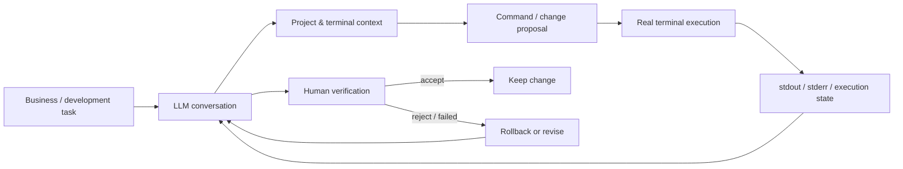

# AI Development Workbench

> **Project codename:** GPTLover  
> **Status:** actively used in my day-to-day development workflow  
> **Source code:** private

A human-in-the-loop AI-assisted development environment designed to reduce the friction between an LLM conversation, a real project, and an interactive terminal.

The project was created because ordinary chat-based AI development required too much manual transfer of context: terminal output, errors, repository state, command results, and follow-up instructions had to be copied between tools by hand.

This workbench turns that fragmented process into one controlled workflow where the human remains the decision-maker.

---

## The problem

When an LLM is used for real software work, the difficult part is often not generating code. The difficult part is keeping the model connected to the **actual state of the project**:

- what command was executed;
- what stdout/stderr actually returned;
- which terminal/session the result belongs to;
- whether the result is still current;
- whether a change passed build/runtime checks;
- whether the human accepted the change or rolled it back.

Manual copy/paste works for small tasks, but becomes slow and error-prone during longer debugging and development sessions.

---

## The solution

I designed an AI-assisted workflow that connects an LLM-driven browser session with a real interactive terminal and project context.

The system is intentionally **human-in-the-loop**. It does not treat generated code or terminal output as automatically trustworthy: the result is validated in the real environment before a change is accepted.

---

## What I designed and implemented

### Terminal context bridge

The workbench captures relevant terminal context and makes it available to the AI workflow without requiring repeated manual copy/paste.

### Browser / terminal integration

A browser-based LLM session is connected to a specific working terminal/session so that development context remains attached to the correct task.

### Multi-session isolation

The workflow is designed to avoid mixing context between different tabs, terminals, or concurrent tasks.

### Request correlation and stale-result protection

Request identifiers and stale-response guards are used so that delayed or outdated results are not accidentally associated with a newer operation.

### Execution-state tracking

The workflow distinguishes between a command being sent, running, producing output, and completing. This is important for commands where partial terminal output must not be treated as the final result.

### Validation and rollback workflow

My normal development cycle is:

`checkpoint / backup -> change -> build or runtime test -> inspect real result -> keep or rollback`

The tool was built around that process rather than around fully autonomous code generation.

---

## My role

I own the problem definition, workflow design, architecture decisions, testing strategy, and real-environment validation.

My development process for this project is AI-assisted: I use LLMs to accelerate implementation and code analysis, while I define the requirements, choose the architecture, run the system, inspect actual behavior and logs, and decide whether changes are accepted, revised, or reverted.

This project is also an example of how I work on unfamiliar or existing systems: I prefer adapting and integrating useful components instead of rewriting everything from scratch when that is the more efficient engineering choice.

---

## Technology context

The current implementation is built around a customized desktop terminal/browser environment and uses technologies from the modern TypeScript/Electron ecosystem.

Relevant areas include:

- Electron
- TypeScript / JavaScript
- React-based UI components
- interactive terminal integration
- browser integration
- Git / GitHub workflow
- runtime logging and diagnostics
- automated build and targeted tests

The underlying workspace includes third-party/open-source components. Their original licenses remain applicable to those components.

---

## Result

The workbench is used in my real development process to shorten the feedback loop between:

**task -> implementation -> terminal execution -> real error/output -> correction -> verification**

Instead of treating the LLM as an autonomous programmer, the system makes it a tightly integrated engineering tool while preserving explicit human control over execution and acceptance of changes.

---

## Why this case matters

This project demonstrates more than prompt usage. It required me to:

- identify a workflow bottleneck;
- design a system around real operational constraints;
- integrate multiple existing components;
- reason about state, concurrency and stale results;
- test behavior in a real desktop/terminal environment;
- improve the tool iteratively based on failures observed during daily use.

---

## Source availability

The production/source repository is **private** and is not distributed through this portfolio repository.

This repository is a public case study only. It contains no application source code, credentials, private configuration, or distributable build artifacts.

Some parts of the private implementation are based on or interact with third-party/open-source software. Those components remain subject to their respective licenses.

For recruitment or technical interviews, I can demonstrate the workflow and discuss architecture and engineering decisions without publishing the private source code.
