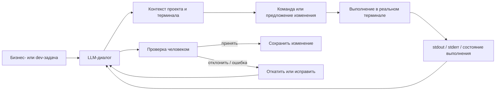

# AI Development Workbench

[Українська](README.md) · [Русский](README.ru.md) · [English](README.en.md)

> **Кодовое название проекта:** GPTLover  
> **Статус:** активно используется в моём ежедневном процессе разработки  
> **Исходный код:** приватный

Human-in-the-loop среда для AI-assisted development, созданная для того, чтобы уменьшить разрыв между разговором с LLM, реальным состоянием проекта и интерактивным терминалом.

Проект появился из практической проблемы: при разработке через обычный чат приходилось вручную переносить между инструментами контекст терминала, ошибки, состояние репозитория, результаты команд и последующие инструкции.

AI Development Workbench объединяет этот фрагментированный процесс в управляемый workflow, в котором человек остаётся тем, кто принимает решения.

---

## Проблема

Когда LLM используется для реальной разработки, сложность часто заключается не в генерации кода, а в том, чтобы модель работала с **фактическим состоянием проекта**:

- какая команда была выполнена;
- что реально вернули stdout/stderr;
- к какому терминалу или сессии относится результат;
- остаётся ли результат актуальным;
- прошла ли правка build/runtime-проверки;
- была ли правка принята человеком или откатана.

Ручной copy/paste работает для небольших задач, но становится медленным и ненадёжным во время длинных сессий отладки и разработки.

---

## Решение

Я спроектировала AI-assisted workflow, который связывает браузерную LLM-сессию с реальным интерактивным терминалом и контекстом проекта.

Система намеренно построена как **human-in-the-loop**. Сгенерированный код или результат команды не считается автоматически правильным: изменения проверяются в реальной среде перед принятием.

---

## Что я спроектировала и реализовала

### Мост контекста терминала

Система собирает релевантный контекст терминала и передаёт его в AI-workflow без постоянного ручного copy/paste.

### Интеграция браузера и терминала

Конкретная браузерная LLM-сессия связывается с конкретным рабочим терминалом/сессией, чтобы контекст разных задач не смешивался.

### Изоляция нескольких сессий

Workflow учитывает параллельную работу с несколькими вкладками, терминалами и задачами и не должен смешивать их состояние.

### Request correlation и защита от устаревших результатов

Используются request-id и stale-response guards, чтобы задержанный или устаревший результат не был ошибочно привязан к более новой операции.

### Отслеживание состояния выполнения

Система различает этапы: команда отправлена, выполняется, генерирует промежуточный вывод и завершена. Это важно для длительных процессов, где частичный terminal output нельзя считать финальным результатом.

### Проверка и rollback

Мой обычный рабочий цикл:

`checkpoint / backup -> изменение -> build или runtime test -> проверка фактического результата -> сохранить или откатить`

Инструмент построен вокруг этого процесса, а не вокруг полностью автономной генерации кода.

---

## Моя роль

Я отвечаю за постановку задачи, проектирование workflow, архитектурные решения, стратегию тестирования и проверку в реальной среде.

Разработка этого проекта является AI-assisted: я использую LLM для ускорения реализации и анализа кода, но самостоятельно формирую требования, выбираю архитектуру, запускаю систему, анализирую фактическое поведение и логи и решаю, принимать, менять или откатывать результат.

Этот проект также показывает мой подход к незнакомым или уже существующим системам: если это инженерно целесообразно, я предпочитаю адаптацию и интеграцию полезных компонентов вместо переписывания всего с нуля.

---

## Технологический контекст

Текущая реализация построена вокруг кастомизированного desktop terminal/browser environment и использует современный TypeScript/Electron стек.

Ключевые направления:

- Electron;
- TypeScript / JavaScript;
- React-based UI components;
- интеграция с интерактивным терминалом;
- browser integration;
- Git / GitHub workflow;
- runtime logging и диагностика;
- автоматизированные build-проверки и targeted tests.

Внутренний workspace содержит сторонние open-source компоненты. Для них сохраняют силу их оригинальные лицензии.

---

## Результат

Workbench используется в моём реальном процессе разработки, чтобы сократить feedback loop между:

**задача -> реализация -> выполнение в терминале -> реальная ошибка/вывод -> исправление -> проверка**

Вместо того чтобы использовать LLM как автономного программиста, система превращает её в тесно интегрированный инженерный инструмент с явным человеческим контролем над выполнением и принятием изменений.

---

## Почему этот кейс важен

Этот проект демонстрирует больше, чем просто умение писать промпты. Для его создания нужно было:

- найти bottleneck в реальном workflow;
- спроектировать систему вокруг практических ограничений;
- интегрировать несколько существующих компонентов;
- работать с состоянием, конкурентностью и устаревшими результатами;
- проверять поведение в реальной desktop/terminal среде;
- итеративно улучшать инструмент на основе ошибок, выявленных во время ежедневного использования.

---

## Доступность исходного кода

Основной рабочий репозиторий является **приватным** и не распространяется через этот portfolio repository.

Этот репозиторий — только публичный case study. Он не содержит исходный код приложения, credentials, приватные конфигурации или build artifacts для распространения.

Часть приватной реализации основана на стороннем/open-source программном обеспечении или взаимодействует с ним. Такие компоненты остаются под условиями своих соответствующих лицензий.

На техническом собеседовании я могу продемонстрировать workflow и обсудить архитектуру и инженерные решения без публикации приватного исходного кода.
