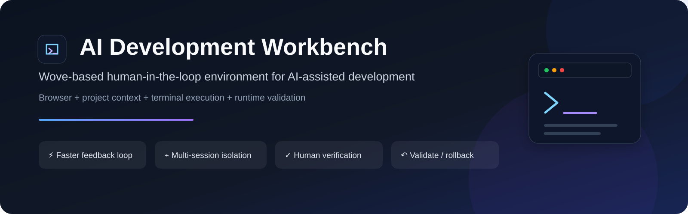
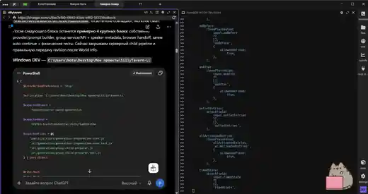
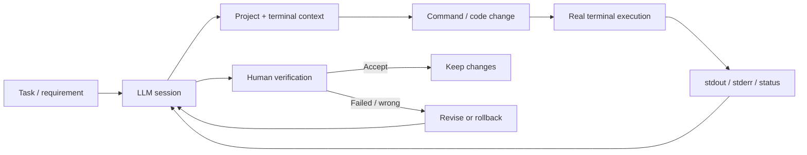

  <a href="README.md">Українська</a> · <a href="README.ru.md">Русский</a> · <a href="README.en.md">English</a>

  

# AI Development Workbench

**Портфолио-кейс модификации Wove для AI-assisted development.**  
Локальная human-in-the-loop среда, которая объединяет LLM-сессию, реальный контекст проекта, интерактивный терминал, выполнение команд и проверку фактического результата.

  
  
  
  
  
  

> [!IMPORTANT]
> Это **публичный portfolio case study**, а не репозиторий с исходным кодом. Рабочая реализация приватна. Текущий продукт является **кастомной модификацией Wove**, а сторонние/open-source компоненты остаются под условиями своих исходных лицензий.

| | |
|---|---|
| **Тип решения** | Desktop developer tool / AI-assisted workflow |
| **Основа** | Wove, модифицированный под собственный workflow |
| **Моя роль** | Постановка задачи, workflow design, архитектурные решения, AI-assisted implementation, runtime validation |
| **Ключевая интеграция** | Browser/LLM ↔ project context ↔ interactive terminal |
| **Статус** | Активно используется в ежедневной разработке |
| **Исходный код** | Private |

---

## 🖥️ Product in Action

Ниже — **реальный скриншот рабочего окружения**, а не макет. Слева работает LLM-сессия с контекстом задачи и командами, справа — модифицированный Wove с интерактивным терминалом и фактическим состоянием проекта.

  

LLM планирует изменения → команда выполняется в реальном терминале → stdout/stderr возвращаются в workflow → результат проверяется человеком.

---

## 🎯 Engineering problem

Обычный chat-based AI хорошо генерирует код, но плохо видит **фактическое состояние рабочего окружения**. Во время длинной разработки приходится вручную переносить между чатами и инструментами контекст проекта, команды, stdout/stderr, build/runtime результаты, состояние репозитория и последующие инструкции.

Это увеличивает ручную работу и создаёт риск использовать **устаревший или относящийся к другой сессии результат**.

## 💡 Решение

Я перестроила Wove под workflow, в котором браузерная LLM-сессия и конкретный рабочий терминал связаны между собой, а результат исполнения возвращается в тот же цикл разработки.

Система намеренно остаётся **human-in-the-loop**: AI ускоряет анализ и реализацию, но результат не принимается без проверки в реальном окружении.

---

## ✅ Реализовано

| Направление | Что делает система |
|---|---|
| **Terminal context bridge** | Передаёт фактический terminal context без постоянного ручного copy/paste |
| **Browser ↔ terminal binding** | Связывает конкретную LLM-сессию с конкретным рабочим терминалом |
| **Multi-session isolation** | Не позволяет контексту параллельных вкладок/задач смешиваться |
| **Request correlation** | Использует request-id для сопоставления запроса и результата |
| **Stale-result protection** | Защищает от использования запоздалого результата как ответа на новую операцию |
| **Execution-state tracking** | Различает sent / running / intermediate output / completed |
| **Validation workflow** | Поддерживает цикл change → build/runtime check → inspect → accept/revise |
| **Rollback-oriented process** | Работает вокруг checkpoint / backup и безопасного отката |

---

## 👤 Моя роль

Мой цикл работы:

> **определить проблему → сформировать требования → выбрать архитектуру → адаптировать существующий компонент → реализовать изменения с AI-assisted development → запустить в реальном окружении → проверить фактическое поведение → принять / изменить / откатить**

Я отвечаю за постановку задачи, workflow и архитектуру, работу с существующей кодовой базой, тестирование, анализ runtime output, поиск race/stale-state проблем и решение о принятии либо rollback изменений.

---

## 🧰 Technology Stack

`TypeScript` · `JavaScript` · `Electron` · `React` · `Node.js` · `Wove` · `xterm` · `PowerShell / terminal integration` · `Git / GitHub` · `runtime logging` · `targeted tests`

Реализация построена на модифицированном Wove. В его package metadata используется Apache-2.0; соответствующие сторонние компоненты не перелицензируются этим portfolio repository.

---

## 📈 Результат

Workbench сокращает feedback loop между:

**задача → анализ → изменение → исполнение → реальный output → исправление → проверка**

Главная ценность инструмента — **уменьшить потерю контекста и количество ручных переходов между AI, проектом и runtime-средой**.

## 🔎 Почему этот кейс важен

Проект показывает способность разбираться в существующем сложном продукте, проектировать интеграции между browser UI и runtime, работать со state/concurrency/stale results и использовать AI как engineering multiplier при сохранении человеческого контроля.

---

## 🎥 Demo / technical discussion

Исходный код рабочей реализации не публикуется, но на техническом интервью я могу показать live workflow, взаимодействие LLM и терминала и обсудить request correlation, stale guards, session isolation и validation/rollback flow.

> Подробнее: [NOTICE.md](NOTICE.md)
